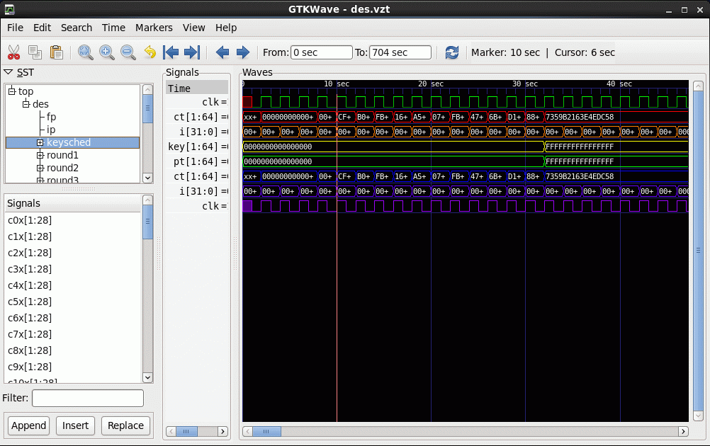
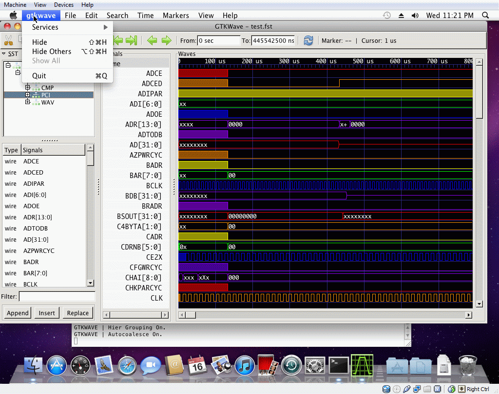

# Compiling and Installing GTKWave

## Unix and Linux Operating Systems

Compiling GTKWave on Unix or Linux operating systems should be a
relatively straightforward process as GTKWave was developed under both
Linux and AIX. External software packages required are GTK
([http://www.gtk.org](http://www.gtk.org/)) with versions 1.3 or 2.x
(3.x not yet supported), and *gperf* (for RTLBrowse) which can be
downloaded from the GNU website
([http://www.gnu.org](http://www.gnu.org/)). The compression libraries
libz (*zlib*) and libbz2 (*bzip2*) are not required to be installed on a
target system as their source code is already included in the GTKWave
tarball, however the system ones will be used if located.

### Compiling and Installing

Un-tar the source code into any temporary directory then change
directory into it. After doing this, invoke the configure script. Note
that if you wish to change the install point, use the double dash
\--*prefix* option to point to the absolute pathname. For example, to
install in /usr, type ***./configure \--prefix=/usr***.

```bash
1 :/tmp/gtkwave-3.1.3\> ./configure
```

Use the \--*help* flag to see which options are available. Typically,
outside of \--*prefix*, no flags are needed.

```bash
2 :/tmp/gtkwave-3.1.3\> make
```

Wait for the compile to finish. This will take some amount of time. Then
log on as the superuser.

```bash
3 :/tmp/gtkwave-3.1.3\> **su**
Password:
[root@localhost gtkwave-3.1.3]# make install
```

Wait for the install to finish. It should proceed relatively quickly.
When finished, exit as superuser.

```bash
[root@localhost gtkwave-3.1.3]# exit
exit
```

GTKWave is now installed on your Unix or Linux system. To use it, make
sure that the *bin/* directory off the install point is in your path.
For example, if the install point is */usr/local*, ensure that
*/usr/local/bin* is in your path. How to do this will vary from shell to
shell.

:::{figure-md}



GTKWave running under Linux.
:::

## **Microsoft Windows Operating Systems**

### Cygwin

The best way to run GTKWave under Windows is to compile it to run under
Cygwin. This will provide the same functionality as compared to the
Unix/Linux version and better graphical performance than the native
binary version. Follow the directions for Unix compiles in the preceding
section. Note that launching RTLBrowse requires Cygserver to be enabled.
Please see the Cygwin documentation for information on how to enable
Cygserver for your version of Cygwin.
(<http://www.cygwin.com/cygwin-ug-net/using-cygserver.html>)

### MinGW versus VC++ for Native Binaries

It is recommended that Windows compiles and installs are done in the
MinGW environment in order to mimic the Unix shell environment as well
as produce binaries that are natively usable on Windows. Producing
native binaries with VisualC++ has not been attempted for some time so
it is currently untested.

### MinGW with GTK-1.2

If you are missing a working version of *gtk-config*, you will need a
fake *gtk-config* file in order to compile under GTK-1.2. It will look
like this with the include and linker search directories modified
accordingly:

```bash
#!/bin/sh

if [ "$1" == "--libs" ]
then
    echo -L/home/bybell/libs -lgck -lgdk-1.3 -lgimp-1.2 -lgimpi -lgimpui-1.2 \
    -lglib-1.3 -lgmodule-1.3 -lgnu-intl -lgobject-1.3 -lgthr ead-1.3 -lgtk-1.3 \
    -liconv-1.3 -ljpeg -llibgplugin_a -llibgplugin_b -lpng -lpthread32 \
    -ltiff-lzw -ltiff-nolzw -ltiff
fi

if [ "$1" == "--cflags" ]
then
    echo " -mms-bitfields -I/home/bybell/src/glib
    -I/home/bybell/src/gtk+/gtk -I/home/bybell/src/gtk+/gdk
    -I/home/bybell/src/gtk+ "
fi
```

Compiling as under Unix/Linux is the same.

### MinGW with GTK-2.0

You do not need to do anything special except ensure that *pkg-config*
is pointed to by your PATH environment variable. Proceed as with
GTK-1.2. Pre-made binaries can be found at the
<http://www.dspia.com/gtkwave.html> website.

## Apple Macintosh Operating Systems

### OSX / Macports

All functionality of the Linux/UNIX version is present in the OSX
version when GDK/GTK is compiled for X11. If GDK/GTK is compiled for
Quartz (i.e., */opt/local/etc/macports/variants.conf* has a line of the
form *+no_x11 +quartz*) and the package gtk-osx-application is also
installed, GTKWave will behave more like a Mac application with native
menus, an icon on the dock, etc. as shown below.

:::{figure-md}



Demonstrating application integration with Mac OSX / Quartz
:::

Note that if running GTKWave on the command line out of a precompiled
bundle *gtkwave.app*, it is required that the Perl script
*gtkwave.app/Contents/Resources/bin/gtkwave* is invoked to start the
program. Please see the gtkwave(1) man page for more information.
