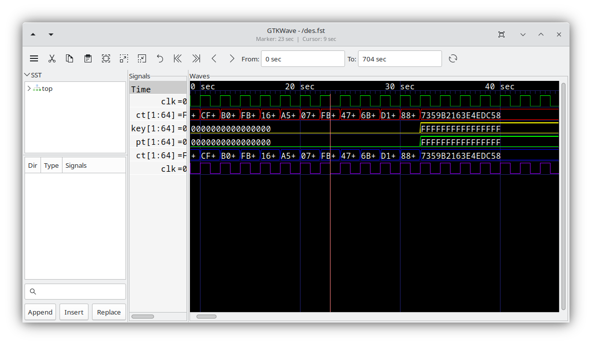

# Introduction

## What Is GTKWave?

GTKWave is a fully featured wave viewer based on GTK for Unix, Win32,
and Mac OSX. It supports various file formats including FST, LXT, LXT2,
VZT, GHW, and standard Verilog VCD/EVCD files. Primarily used for
debugging Verilog or VHDL simulation models, GTKWave is designed
for post-mortem analysis by analyzing dumpfiles rather than real-time
interaction during simulations. It allows the visualization of both
analog and digital data, supports various search operations, and
enables users to save "signals of interest" extracted from a complete
simulation dump. Additionally, GTKWave can generate outputs in
PostScript and FrameMaker formats for hard copy documentation.

:::{figure-md}



GTKWave Screenshot
:::

GTKWave also includes a suite of helper applications designed for
specialized tasks such as file conversion, RTL parsing, and other
data manipulation operations that extend beyond the typical scope
of a visualization tool. These applications are meant to work
together as a cohesive system. However, their modular design also
allows them to operate independently if necessary.

## Why Use GTKWave?

GTKWave has been developed to perform debug tasks on large systems on a
chip and has been used in this capacity as an offline replacement for
third-party debug tools. It is 64-bit clean and is ready for the largest
of designs given that it is run on a workstation with a sufficient
amount of physical memory. The file format FST has been designed to
handle extremely large, real-world designs efficiently.

For Verilog, GTKWave allows users to debug simulation results at both
the net level by providing a bird\'s eye view of multiple signal values
over varying periods of time and also at the RTL level through
annotation of signal values back into the RTL for a given timestep
(see [RTLBrowser](tools/rtlbrowse.md#rtlbrowse)). The
RTL browser frees up users from needing to be concerned with the actual
location of where a given module resides in the RTL as the view provided
by the RTL browser defaults to the module level. This provides quick
access to modules in the RTL as navigation has been reduced simply to
moving up and down in a tree structure that represents the actual
design.

Source code annotation is currently not available for VHDL. However, all
of GTKWave\'s other debug features are readily accessible. VHDL support
is planned for a future release.


```{toctree}
:hidden:
:caption: Introduction

self
intro/formats
```

```{toctree}
:hidden:
:caption: Compiling and Installing

install/unix_linux
install/win
install/mac
```

```{toctree}
:hidden:
:caption: Quick Start

quickstart/sample
quickstart/launching
quickstart/filters
quickstart/pattern-search
```

```{toctree}
:hidden:
:caption: User Interface

ui/overview
ui/mainwindow
ui/toolbar
ui/menu
ui/extras
```

```{toctree}
:hidden:
:caption: Additional tools

tools/twinwave
tools/rtlbrowse
```


```{toctree}
:hidden:
:caption: Tcl Command Syntax

tcl/commands
tcl/callbacks
```

```{toctree}
:hidden:
:glob:
:caption: GTKWave internals

internals/*
```

```{toctree}
:hidden:
:glob:
:caption: Man pages

man/*
```