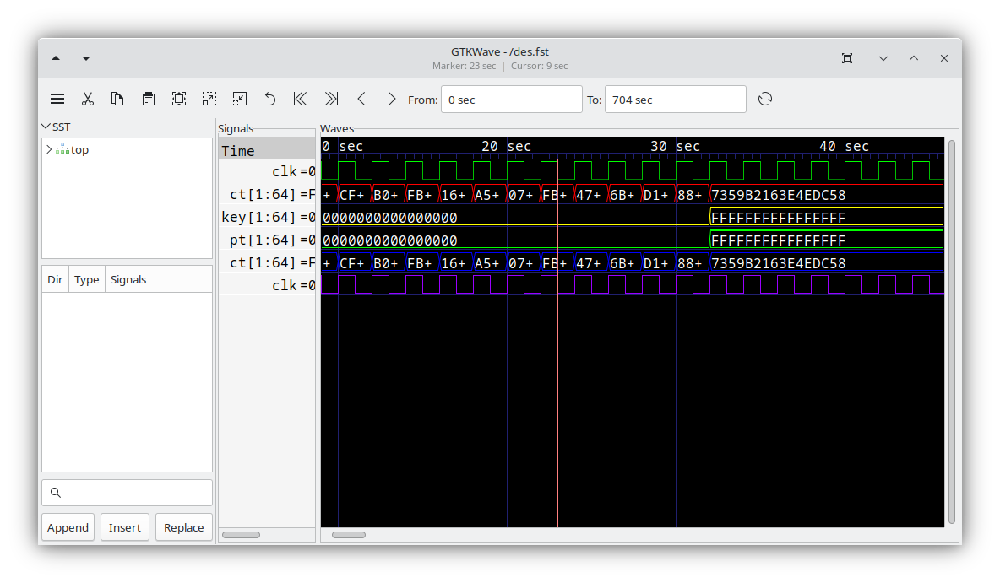

# Unix and Linux

```{toctree}
:hidden:
unix_linux_4
```

This section focus on compiling and installing GTKWave 3.3 LTS.
If you want to try the GTKWave 4, please refer to
[Compiling GTKWave 4](unix_linux_4.md).

Compiling GTKWave on Unix or Linux operating systems should be a
relatively straightforward process as GTKWave was developed under both
Linux and AIX.

## Installing dependencies

Debian, Ubuntu:
```bash
sudo apt install build-essential libbz2-dev liblzma-dev
sudo apt install gperf libgtk-3-dev automake
sudo apt install tcl-dev tk-dev
sudo apt install libjudy-dev # optional
```

## Compiling and Installing

Download the source tarball from
[https://gtkwave.sourceforge.net/](https://gtkwave.sourceforge.net/)
or clone the sources from the git repository:

```bash
git clone https://github.com/gtkwave/gtkwave/ -b lts gtkwave
cd gtkwave/gtkwave3-gtk3 && ./autogen.sh
```

After doing this, you must decide how you're going
to install GTKWave onto your system. By default, the
software is installed in `/usr/local/`. If you wish to
install into a specific prefix, use the double dash
\--*prefix* option to point to the absolute pathname. 

For example, to install in `/opt`

```bash
./configure --enable-gtk3 --enable-judy --prefix=/opt
```

Or, to install GTKWave globally

```bash
./configure --enable-gtk3 --enable-judy
```
Use the \--*help* flag to see which options are available.

After invoking the configure script. Use *make* to compile GTKWave
```bash
make -j
```

Then wait for the compile to finish. This will take some amount of
time.

To install GTKWave, run

```bash
sudo make install
```

Wait for the install to finish. It should proceed relatively quickly.


GTKWave is now installed on your Unix or Linux system. To use it, make
sure that the *bin/* directory of the install point is in your path.
For example, if the install point is */usr/local*, ensure that
*/usr/local/bin* is in your path. How to do this will vary from shell to
shell.

:::{figure-md}



GTKWave running under Linux.
:::
