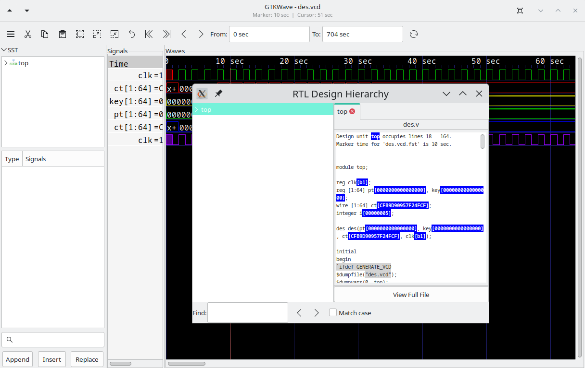
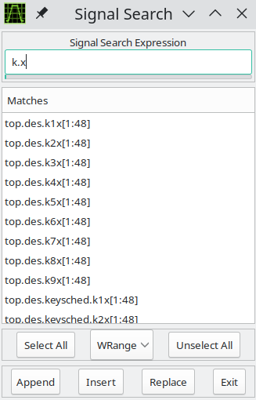
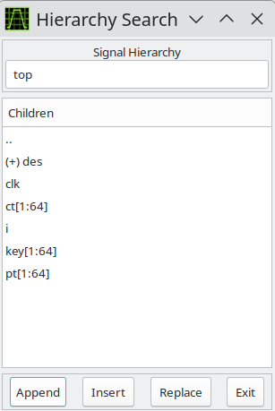
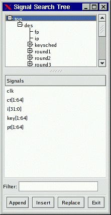
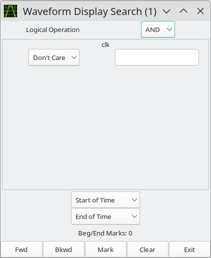

# Quick Start

## Sample Design

In the *examples/* directory of the source code distribition a sample
Verilog design and testbench for a DES encryptor can be found as
*des.v*.

```text
10 :/home/bybell/gtkwave-3.0.0pre21/examples> ls -al
total 132
drwxrwxr-x 2 bybell bybell 4096 Apr 30 14:12 .
drwxr-xr-x 8 bybell bybell 4096 Apr 29 22:05 ..
-rw-rw-r-- 1 bybell bybell 187 Apr 29 22:09 des.sav
-rw-r--r-- 1 bybell bybell 47995 Apr 29 22:05 des.v
-rw-rw-r-- 1 bybell bybell 68801 Apr 29 22:06 des.vzt
```

If you have a Verilog simulator handy, you can simulate the design to
create a VCD file. To try the example in Icarus Verilog
([http://www.icarus.com](http://www.icarus.com/)), type the following:

```text
/tmp/gtkwave-3.0.0/examples> **iverilog des.v && a.out**
VCD info: dumpfile des.vcd opened for output.
/tmp/gtkwave-3.0.0/examples> **ls -la des.vcd**
-rw-rw-r-- 1 bybell bybell 3465481 Apr 30 13:39 des.vcd
```

If you do not have a simulator readily available, you can expand the
*des.vzt* file into *des.vcd* by typing the following:

```text
/tmp/gtkwave-3.0.0/examples> vzt2vcd des.vzt >des.vcd
VZTLOAD | 1432 facilities
VZTLOAD | Total value bits: 22921
VZTLOAD | Read 1 block header OK
VZTLOAD | [0] start time
VZTLOAD | [704] end time
VZTLOAD |
VZTLOAD | block [0] processing 0 / 704
/tmp/gtkwave-3.0.0/examples> ls -la des.vcd
-rw-rw-r-- 1 bybell bybell 3456247 Apr 30 13:42 des.vcd
```

You will notice that the generated VCD file is about fifty times larger
than the VZT file. This illustrates the compressibility of VCD files and
the space saving advantages of using the database formats that GTKWave
supports. Normally we would not want to work with VCD as GTKWave is
forced to process the whole file rather than access only the data
needed, but in the next section we will show how to invoke GTKWave such
that VCD files are automatically converted into LXT2 ones.

Next, let's create a stems file that allows us to bring up RTLBrowse.

```text
/tmp/gtkwave-3.0.0/examples> verilator -Wno-fatal des.v -xml-only
--bbox-sys && xml2stems obj_dir/Vdes.xml des.stems
/tmp/gtkwave-3.0.0/examples> ls -la des.stems
-rw-rw-r-- 1 bybell bybell 4044 Apr 30 13:50 des.stems
```

Stems files only need to be generated when the source code undergoes
file layout and/or hierarchy changes.

Now that we have a VCD file and a stems file, we can bring up the
viewer.

## Launching GTKWave

We already have a VZT file available, but to illustrate the automatic
conversion of VCD files, let's use the `-o` option. The `-t` option is used
to specify the stems file. The .sav file is a "save file" that contains
GTKWave scope state.

```text
/tmp/gtkwave-3.0.0/examples> gtkwave -o -t des.stems des.vcd
des.sav
GTKWave Analyzer v3.3.18 (w)1999-2010 BSI
FSTLOAD | Processing 1432 facs.
FSTLOAD | Built 1287 signals and 145 aliases.
FSTLOAD | Building facility hierarchy tree.
FSTLOAD | Sorting facility hierarchy tree.
```

:::{figure-md}



The main window with viewer state loaded from a save file
:::

In some cases, for example if the dumpfile format is
LXT2, you will see two sets of loader messages. This is normal as
RTLBrowse is launched as an external process in order to keep its
operations from bogging down the viewer. After these messages scroll by,
the GTKWave main window and an RTLBrowse hierarchy window will appear.
We are now ready to start experimenting with various features of the
wave viewer and RTLBrowse.

The RTLBrowse window will come up as seen in on page, however none of
the tree nodes will be opened yet.

## Displaying Waveforms

In the preceding section, the viewer was brought up with a save file so
when the viewer did appear, the main window already had signals present
as seen in on page . All the signals in a model do not appear on their
own as this would be unwieldy for large models. Instead, it is up to the
user to import signals manually. An exception to this exists for VCD files, see
the definition of the [`enable_vcd_autosave` *.gtkwaverc* variable](#anchor-6).
That said, several requesters exist for importing signals into the main window.

### Signal Search

:::{figure-md}



The Signal Search (regular expression search) Requester
:::

The signal search requester accepts a search string as a POSIX regular
expression. Any signals found in the dumpfile that match that regular
expression are listed in the Matches box and may be individually or
multiply selected and imported into the viewer window. The regular
expression can be modified in one of four ways: WRange, WStrand, Range,
and Strand. No modification is possible with None. This optionally
matches the string you enter in the search string above with a Verilog
format range (signal[7:0]), a strand (signal.1, signal.0), or with no
suffix. The "W" modifier for "Range" and "Strand" explicitly matches on
word boundaries. (addr matches unit.freezeaddr[63:0] for "Range" but
only unit.addr[63:0] for "WRange" since addr has to be on a word
boundary.) Note that when "None" is selected, the search string may be
located anywhere in the signal name.

Append will add the selected signals to end of the display on the main
window.

Insert will add selected signals after last highlighted signal on the
main window.

Replace will replace highlighted signals on the main window with signals
selected.

### Hierarchy Search

:::{figure-md}



The Hierarchy Search Requester
:::

The hierarchy search requester provides a view of the hierarchy in a
format similar to the current working directory of a file in a file
system on a computer. The Signal Hierarchy box contains the current
hierarchy and the Children box contain all of the signals in that
immediate level of hierarchy and all of the component instantiation
names for that level of hierarchy (denoted by a "(+)" prefix). To
navigate down a level of hierarchy, click on an item with a "(+)"
prefix. To move up a level of hierarchy, click on the ".." line.

Selecting individual items allow you to import traces singly when the
Append, Insert, or Replace buttons are clicked. Not selecting anything
will do a "deep import" such that all the child signals are imported.
Use of that feature is not recommended for very large designs.

Note that is is possible to modify the display order such that
components and signals are intermixed in this gadget rather than being
separated such that all the components for a given level of hierarchy
are listed alphabetically at the top and all signals are listed
alphabetically at the bottom. In order to do this, toggle the Search
submenu item Search Hierarchy Grouping as described on page
[43](#anchor-18).

### Tree Search

The Tree Search Requester is the requester that most users will feel
comfortable using and is also the requester that can optionally be
embedded in the main window on versions of GTK greater than or equal to
2.4. See on page for an example of this.

The Tree Search Requester is composed of a top tree selection box, a
signals box, and a POSIX regular expression filter. The tree selection
box is used to navigate at the hierarchy level. Click on an item in
order to show the signals at that level of hierarchy. In the figure on
page , the "top" level of hierarchy is selected and the signals box
shows what signals are available at that level of hierarchy. Signals may
be individually or multiply selected and can be dragged and dropped into
the signal window. In addition, a POSIX filter can be specified that
allows the selective filtering of signal names at a level of hierarchy
which is handy for finding a specific signal at a level of hierarchy
that is very large (e.g., in a synthesized netlist).

:::{figure-md}



The Signal Search Tree Requester
:::

### Signal Save Files

The signals show in the main window can be saved to a file so they can
automatically be imported without reselection the next time the viewer
is started. In order to save signals to a save file, select the File
submenu option Write Save File (As). Save files can also be loaded at
any time by selecting the Read Save File option.

### Pattern Search

Values, not only nets may be searched on and marked in the wave window.
In order to do this, select one or more nets in the signal window and
then click on the Search submenu option Pattern Search. A Pattern Search
Requester will then appear that will allow various types of search
operations for the signals that have been selected.

The following is an example of a Pattern Search Requester being used to
mark the rising edges for the clock signal in a simulation model.

:::{figure-md}



The Pattern Search Requester
:::

The edges as they are marked by the configuration of
the Requester in Figure can be seen in on page .

To remove pattern marks, either select another pattern or select the
View submenu option Remove Pattern Marks. Note that pattern marks save
to the save file and that the actual pattern search criteria is saved,
not the absolute times of the individual marks themselves.

Search criteria for individual nets can be edge or value based. For
"String" searches (the entry box to the right of the search type box
which in the case above is marked "Rising Edge"), note that is is no
longer required that you must press Enter for the string in order to
commit the value to the search.

### Alias Files and Attaching External Disassemblers

The viewer supports signal aliasing through both plaintext filters and
through external program filters. Note that signal aliasing is a strict
one-to-one correspondence so the value represented in the viewer must
exactly represent what format your filter expects. (e.g., binary,
hexadecimal, with leading base markers, etc.) For your convenience, the
comparisons are case insensitive.

For text filters, the viewer looks at an ASCII text file of the
following format:

```text
#
# this is a comment
#
00 Idle
01 Advance
10 Stop
11 Reset
```

The first non-whitespace item is treated as a literal value that would
normally be printed by the viewer and the remaining items on the line
are substitution text. Any time this text is encountered if the filter
is active, it will replace the left-hand side text with the right-hand
side. Leading and trailing whitespaces are removed from the right-hand
side item.

To turn on the filter:

1. Highlight the signals you want filtered
1. Edit->Data Format->Translate Filter File->Enable and Select
1. Add Filter to List
1. Click on filter filename
1. Select filter filename from list
1. OK

To turn off the filter:

1. Highlight the signals you want unfiltered.
1. Edit->Data Format->Translate Filter File->Disable

!!! note
    Filter configurations load and save properly to and from save files.

An external process that accepts one line in from stdin and returns with
data on stdout can be used as a process filter. An example of this are
disassemblers. The following sample code would show how to interface
with a disassembler function in C:

```c
int main(int argc, char **argv)
{
    while (!feof(stdin)) {
        char buf[1025], buf2[1025];
        buf[0] = 0;
        fscanf(stdin, "%s", buf);
        if (buf[0]) {
            int hx;
            sscanf(buf, "%x", &hx);
            ppc_dasm_one(buf2, 0, hx);
            printf("%s\n", buf2);
            fflush(stdout);
        }
     }
    return 0;
}
```

Note that the `#!c fflush(stdout)` is necessary, otherwise *gtkwave* will
hang. Also note that every line of input needs to generate a line of
output or the viewer will hang too.

To turn on the filter:

1. Highlight the signals you want filtered
1. Edit->Data Format->Translate Filter Process->Enable and Select
1. Add Proc Filter to List
1. Click on filter filename
1. Select filter filename from list
1. OK

To turn off the filter:

1. Highlight the signals you want unfiltered.
1. Edit->Data Format->Translate Filter Process->Disable

Note: In order to use the filter to modify the background color of a
trace, you can prefix the return string to stdout with the X11 color
name surrounded by '?' characters as follows:

```text
?CadetBlue?isync
?red?xor r0,r0,r0
?lavender?lwz r2,0(r7)
```

Legal color names may be found in the `rgb.c` file in the source code
distribution.

## Transaction Filters

Either single traces or grouped vector data (created by Combine Down
(F4) on some signals) can be used to signify a transaction that can be
parsed by an external process.

An external process that can accept a simplified VCD file from stdin and
return with trace data on stdout can be used as a transaction filter. An
example of the VCD file received from stdin is the following:

```text
$comment data_start 0x124c0798 $end
$comment val[7:0] $end
$timescale 1ms $end
$comment min_time 0 $end
$comment max_time 348927 $end
$comment max_seqn 1 $end
$scope module top $end
$comment seqn 1 top.val[7:0] $end
$var wire 8 1 val[7:0] $end
$upscope $end
$enddefinitions $end
$dumpvars
#0
b10000000 1
#1
b10000101 1
#2
b10001010 1
...
#348927
b110010 1
$comment data_end 0x124c0798 $end
```

To aid in processing and parsing, some extra comments are added to the
VCD file:

* `data_start`, a value to match against data end to know that all trace
data has been received
* `min_time`, the start time of the wave data
* `max_time`, the ending time of the wave data
* `max_seqn`, indicates the relative ordering of the trace data being
    presented. This can be used to provide "anonymous" signal name matching
* `seqn`, gives the "flat earth" signal name

Note that the VCD identifies are numbers starting from 1. These are to
be correlated with the `max_seqn`count.

An example of data generated on stdout after all data has been received
is as follows:

```text
$name Decoded Data
#0
#186608 ?darkblue?sync
MA196608 Sync Mark
#196860
MB196864 Num Blocks
#196864 ?gray24?04
#197116
MC197120 Hdr 0
#197120 ?purple3?04
#197372
$next
$name Another Trace
#0
#10000 This is a test!
#200000
$finish
```

Time values with no data after them are rendered as a horizontal "z"
bar.

Lines that start with M are used to place the markers A-Z.

* `$name` indicates the name to give to the trace.
* `$next` indicated that more trace data follows for a new trace.
* `$finish` is used to signal to gtkwave that there is no more trace data.

The data received by gtkwave will be used to generate transaction traces
in the viewer. In order to make traces created by `$next` visible, insert
blank lines under the trace that the transaction filter has been added.

To turn on the filter:

1. Highlight the signals you want filtered
1. Edit->Data Format->Transaction Filter Process->Enable and Select
1. Add Transaction Filter to List
1. Click on filter filename
1. Select filter filename from list
1. OK

To turn off the filter:

1. Highlight the signals you want unfiltered.
1. Edit->Data Format->Transaction Filter Process->Disable

Note: In order to use the filter to modify the background color of a
trace, you can prefix the return string to stdout with the X11 color
name surrounded by '?' characters as follows:

```text
?CadetBlue?isync
?red?xor r0,r0,r0
?lavender?lwz r2,0(r7)
```

Legal color names may be found in the rgb.c file in the source code
distribution.

## Debugging the Source Code

See the description for RTLBrowse on page [30](#rtlbrowse). More
features are planned to be added in future releases.
