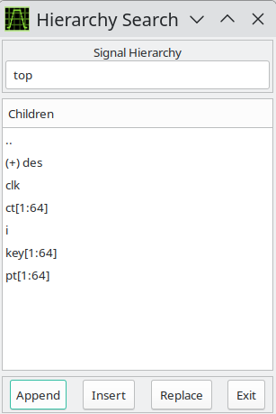

# Displaying Waveforms

In the preceding section, we introduced how to launch GTKWave with a
save file. Now the main window already had signals present
as seen in [Launching GTKWave](launching.md#launching-gtkwave).
All the signals in a model do not appear on their own as this would be
unwieldy for large models. Instead, users must manually import signals
into the main window. An exception to this exists for VCD files, see
the definition of the
[`enable_vcd_autosave` *.gtkwaverc* variable](../man/gtkwaverc.5.md#options).
That said, GTKWave provides several tools for importing signals into
the main window.

## Signal Search

:::{figure-md}

The Signal Search (regular expression search) Requester
:::

The signal search requester accepts a search string as a POSIX regular
expression. Any signals found in the dumpfile that match that regular
expression is listed in the Matches box and may be individually or
multiply selected and imported into the viewer window. 

The regular expression can be modified in one of five ways: `WRange`,
`WStrand`, `Range`, `Strand`, and `None` implies no modification. 
This optionally matches the string entered in the search box above with
either a Verilog format `range` (e.g. signal[7:0]),
`strand` (e.g. signal.0, signal.1, ...), or with no suffix. 
The "W" modifier in "Range" and "Strand" specifically enforces matching
on word boundaries. For example, while `addr` matches `unit.freezeaddr[63:0]`
under "Range", it matches only `unit.addr[63:0]` under "WRange" since
`addr` must be at a word boundary. Note that when "None" is selected,
the search string may be located anywhere in the signal name.

_Append_ will add the selected signals to end of the display on the main
window.

_Insert_ will add selected signals after last highlighted signal on the
main window.

_Replace_ will replace highlighted signals in the main window with signals
selected.

## Hierarchy Search

:::{figure-md}

The Hierarchy Search Requester
:::

The hierarchy search requester provides a view of the hierarchy in a
format similar to the current working directory of a file in a file
system on a computer. The Signal Hierarchy box contains the current
hierarchy and the Children box contains all the signals in that
immediate level of hierarchy and all the component instantiation
names for that level of hierarchy (denoted by a "(+)" prefix). To
navigate down a level of hierarchy, click on an item with a "(+)"
prefix. To move up a level of hierarchy, click on the ".." line.

Selecting individual items allow you to import traces singly when the
Append, Insert, or Replace buttons are clicked. Not selecting anything
will do a "deep import" such that all the child signals are imported.
Use of that feature is not recommended for very large designs.

Note that it is possible to modify the display order such that
components and signals are intermixed in this gadget rather than being
separated, such that all the components for a given level of hierarchy
are listed alphabetically at the top and all signals are listed
alphabetically at the bottom. In order to do this, toggle the Search
submenu item Search Hierarchy Grouping as described in
[Search Hierarchy Grouping](#search-hierarchy-grouping).

:::{attention}
Deprecated and will be removed in GTKWave 4.
Please use the [Signal Search Tree](#signal-search-tree) instead.
:::

## Signal Search Tree

The Signal Search Tree is what most users will feel
comfortable using. 

It is composed of a top tree selection box, a
signal box, and a POSIX regular expression filter. The tree selection
box is used to navigate at the hierarchy level. Click on an item in
order to show the signals at that level of hierarchy. In the following
figure, the `top` level of hierarchy is selected and the signal box
shows what signals are available at that level of hierarchy. Signals may
be individually or multiply selected and can be dragged and dropped into
the signal frame. 

In addition, a POSIX filter can be specified that
allows the selective filtering of signal names at a level of hierarchy
which is handy for finding a specific signal at a level of hierarchy
that is very large (e.g., in a synthesized netlist). See
[Signal Search Tree in GTKWave](../ui/gtkwave.md#signal-search-tree) for
details.

:::{figure-md}

The Signal Search Tree
:::

## Signal Save Files

The signals show in the main window can be saved to a file, so they can
automatically be imported without reselection the next time the viewer
is started. In order to save signals to a save file, select the File
submenu option Write Save File (As). Save files can also be loaded at
any time by selecting the Read Save File option.

## Pattern Search

Not only nets may be searched on and marked in the main window. GTKWave
can search values too.
In order to do this, select one or more nets in the signal frame and
then click on the Search submenu option Pattern Search. A Pattern Search
Requester will then appear that will allow various types of search
operations for the signals that have been selected.

The following is an example of a Pattern Search Requester being used to
mark the rising edges for the clock signal in a simulation model.

:::{figure-md}

The Pattern Search Requester
:::

The edges as they are marked by the configuration of
the Requester can be seen on the wave window.

To remove pattern marks, either select another pattern or select the
View submenu option `Remove Pattern Marks`. Note that pattern marks are saved
to the save file and that the actual pattern search criteria is saved,
not the absolute times of the individual marks themselves.

Search criteria for individual nets can be edge or value based. For
"String" searches (the entry box to the right of the search type box
which in the case above is marked "Rising Edge"), note that it is no
longer required that you must press Enter for the string in order to
commit the value to the search.
