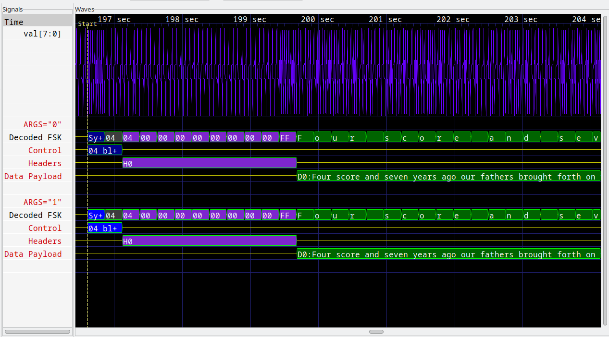

# Filtering

GTKWave supports signal aliasing (filtering) through both plaintext
filters and through external program filters.

## Translate Filter File

For text filters, the viewer looks at an ASCII text file of the
following format:

```text
#
# this is a comment
#
00 Idle
01 Advance
10 Stop
11 Reset
```

The first non-whitespace item is treated as a literal value that would
normally be printed by the viewer, and the remaining items on the line
are substitution text. Any time this text is encountered if the filter
is active, it will replace the left-hand side text with the right-hand
side. Leading and trailing whitespaces are removed from the right-hand
side item.

Note that signal aliasing is a strict
one-to-one correspondence, so the value represented in the viewer must
exactly represent what format your filter expects. (e.g., binary,
hexadecimal, with leading base markers, etc.) For your convenience, the
comparisons are case-insensitive.

To turn on the filter:

1. Highlight the signals you want filtered
2. Edit->Data Format->Translate Filter File->Enable and Select
3. Add Filter to List
4. Click on filter filename
5. Select filter filename from list
6. OK

To turn off the filter:

1. Highlight the signals you want unfiltered.
2. Edit->Data Format->Translate Filter File->Disable

::: {note}
Filter configurations load and save properly to and from save files.
:::

## Translate Filter Process

An external process that accepts one line in from stdin and returns with
data on stdout can be used as a process filter. An example of this is
disassemblers. The following sample code would show how to interface
with a disassembler function in C:

```c
int main(int argc, char **argv)
{
    while (!feof(stdin)) {
        char buf[1025], buf2[1025];
        buf[0] = 0;
        fscanf(stdin, "%s", buf);
        if (buf[0]) {
            int hx;
            sscanf(buf, "%x", &hx);
            ppc_dasm_one(buf2, 0, hx);
            printf("%s\n", buf2);
            fflush(stdout);
        }
     }
    return 0;
}
```

Note that the `fflush(stdout)` is necessary, otherwise GTKWave will
hang. Also note that every line of input needs to generate a line of
output or the viewer will hang too.

To turn on the filter:

1. Highlight the signals you want filtered
2. Edit->Data Format->Translate Filter Process->Enable and Select
3. Add Proc Filter to List
4. Click on filter filename
5. Select filter filename from list
6. OK

To turn off the filter:

1. Highlight the signals you want unfiltered.
2. Edit->Data Format->Translate Filter Process->Disable

Note: In order to use the filter to modify the background color of a
trace, you can prefix the return string to stdout with the X11 color
name surrounded by '?' characters as follows:

```text
?CadetBlue?isync
?red?xor r0,r0,r0
?lavender?lwz r2,0(r7)
```

Legal color names may be found in the `rgb.c` file in the source code
distribution.

## Transaction Filters Process

Either single traces or grouped vector data (created by Combine Down
{kbd}`F4` on some signals) can be used to signify a transaction that can be
parsed by an external process.

An external process that can accept a simplified VCD file from stdin and
return with trace data on stdout can be used as a transaction filter. An
example of the VCD file received from stdin is the following:

```text
$comment data_start 0x124c0798 $end
$comment name val[7:0] $end
$timescale 1ms $end
$comment min_time 0 $end
$comment max_time 348927 $end
$comment max_seqn 1 $end
$comment args "0" $end
$scope module top $end
$comment seqn 1 top.val[7:0] $end
$var wire 8 1 val[7:0] $end
$upscope $end
$enddefinitions $end
#0
$dumpvars
b10000000 1
$end
#1
b10000101 1
#2
b10001010 1
...
#348927
b110010 1
$comment data_end 0x124c0798 $end
```

To aid in processing and parsing, some extra comments are added to the
VCD file:

* `data_start`, a value to match against data end to know that all trace
data has been received
* `min_time`, the start time of the wave data
* `max_time`, the ending time of the wave data
* `max_seqn`, indicates the relative ordering of the trace data being
    presented. This can be used to provide "anonymous" signal name matching
* `seqn`, gives the "flat earth" signal name

Note that the VCD identifies are numbers starting from 1. These are to
be correlated with the `max_seqn`count.

An example of data generated on stdout after all data has been received
is as follows:

```text
$name Decoded Data
#0
#186608 ?darkblue?sync
MA196608 Sync Mark
#196860
MB196864 Num Blocks
#196864 ?gray24?04
#197116
MC197120 Hdr 0
#197120 ?purple3?04
#197372
$next
$name Another Trace
#0
#10000 This is a test!
#200000
$finish
```

Time values with no data after them are rendered as a horizontal "z"
bar.

Lines that start with M are used to place the markers A-Z.

* `$name` indicates the name to give to the trace.
* `$next` indicated that more trace data follows for a new trace.
* `$finish` is used to signal to GTKWave that there is no more trace data.

The data received by GTKWave will be used to generate transaction traces
in the viewer. In order to make traces created by `$next` visible, insert
blank lines under the trace that the transaction filter has been added.

To turn on the filter:

1. Highlight the signals you want filtered
2. Edit->Data Format->Transaction Filter Process->Enable and Select
3. Add Transaction Filter to List
4. Click on filter filename
5. Select filter filename from list
6. OK

To turn off the filter:

1. Highlight the signals you want unfiltered.
2. Edit->Data Format->Transaction Filter Process->Disable

Note: In order to use the filter to modify the background color of a
trace, you can prefix the return string to stdout with the X11 color
name surrounded by '?' characters as follows:

```text
?CadetBlue?isync
?red?xor r0,r0,r0
?lavender?lwz r2,0(r7)
```

Legal color names may be found in the rgb.c file in the source code
distribution.

Users can find an example of Transaction Filter Process in `examples/transaction.c`.

:::{figure-md}



An Example of Transaction Filters Process
:::