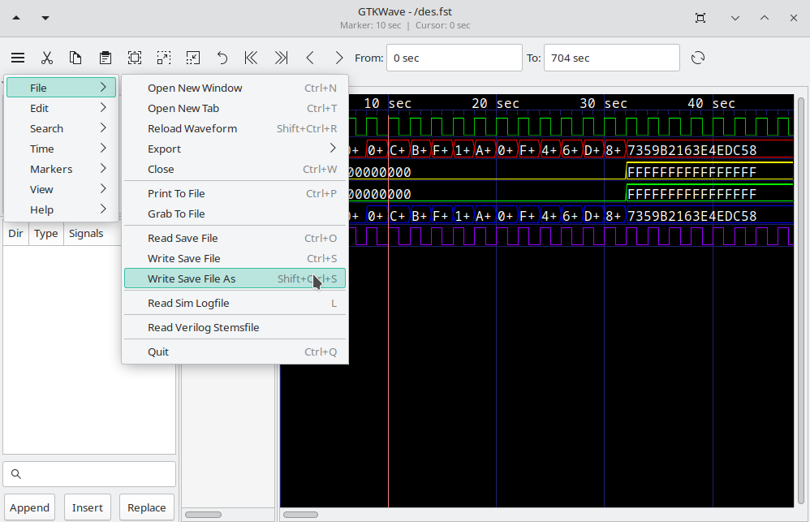

# Launching GTKWave

We already have a `.fst` file available, but to illustrate the automatic
conversion of VCD files, let's use the `-o` option. The `-t` option is used
to specify the `stems` file. The `.gtkw` file is a "save file" that contains
GTKWave scope state.

```text
gtkwave/examples> gtkwave -o -t des.stems des.vcd des.gtkw
GTKWave Analyzer v3.3.118 (w)1999-2023 BSI
FSTLOAD | Processing 1432 facs.
FSTLOAD | Built 1287 signals and 145 aliases.
FSTLOAD | Building facility hierarchy tree.
FSTLOAD | Sorting facility hierarchy tree.
```

:::{figure-md}


The main window with viewer state loaded from a save file
:::

After the splash screen, the GTKWave main window and an RTLBrowse hierarchy
window will appear. We are now ready to start experimenting with
various features of the wave viewer and RTLBrowse.
Refer to the [RTLBrowse description](../ui/rtlbrowse.md#rtlbrowse)
to learn how to use RTLBrowse.

# Displaying Waveforms

In the preceding section, we introduced how to launch GTKWave with a
save file. Now the main window already had signals present
as seen in [Launching GTKWave](launching.md#launching-gtkwave).
All the signals in a model do not appear on their own as this would be
unwieldy for large models. Instead, users must manually import signals
into the main window. An exception to this exists for VCD files, see
the definition of the
[`enable_vcd_autosave` *.gtkwaverc* variable](../man/gtkwaverc.5.md#options).
That said, GTKWave provides several tools for importing signals into
the main window.


## Signal Search

:::{figure-md}


The Signal Search (regular expression search) Requester
:::

The signal search requester accepts a search string as a POSIX regular
expression. Any signals found in the dumpfile that match that regular
expression is listed in the Matches box and may be individually or
multiply selected and imported into the viewer window.

The regular expression can be modified in one of five ways: `WRange`,
`WStrand`, `Range`, `Strand`, and `None` implies no modification.
This optionally matches the string entered in the search box above with
either a Verilog format `range` (e.g. signal[7:0]),
`strand` (e.g. signal.0, signal.1, ...), or with no suffix.
The "W" modifier in "Range" and "Strand" specifically enforces matching
on word boundaries. For example, while `addr` matches `unit.freezeaddr[63:0]`
under "Range", it matches only `unit.addr[63:0]` under "WRange" since
`addr` must be at a word boundary. Note that when "None" is selected,
the search string may be located anywhere in the signal name.

_Append_ will add the selected signals to end of the display on the main
window.

_Insert_ will add selected signals after last highlighted signal on the
main window.

_Replace_ will replace highlighted signals in the main window with signals
selected.


## Signal Search Tree

The Signal Search Tree is what most users will feel
comfortable using.

It is composed of a top tree selection box, a
signal box, and a POSIX regular expression filter. The tree selection
box is used to navigate at the hierarchy level. Click on an item in
order to show the signals at that level of hierarchy. In the following
figure, the `top` level of hierarchy is selected and the signal box
shows what signals are available at that level of hierarchy. Signals may
be individually or multiply selected and can be dragged and dropped into
the signal frame.

In addition, a POSIX filter can be specified that
allows the selective filtering of signal names at a level of hierarchy
which is handy for finding a specific signal at a level of hierarchy
that is very large (e.g., in a synthesized netlist). See
[Signal Search Tree in GTKWave](../ui/mainwindow.md#signal-search-tree) for
details.

:::{figure-md}


The Signal Search Tree
:::

## Save Signals to Files

The signals show in the main window can be saved to a file, so they can
automatically be imported without reselection the next time the viewer
is started. In order to save signals to a save file, select the File
submenu option Write Save File (As). Save files can also be loaded at
any time by selecting the Read Save File option.

:::{figure-md}



Save File
:::
