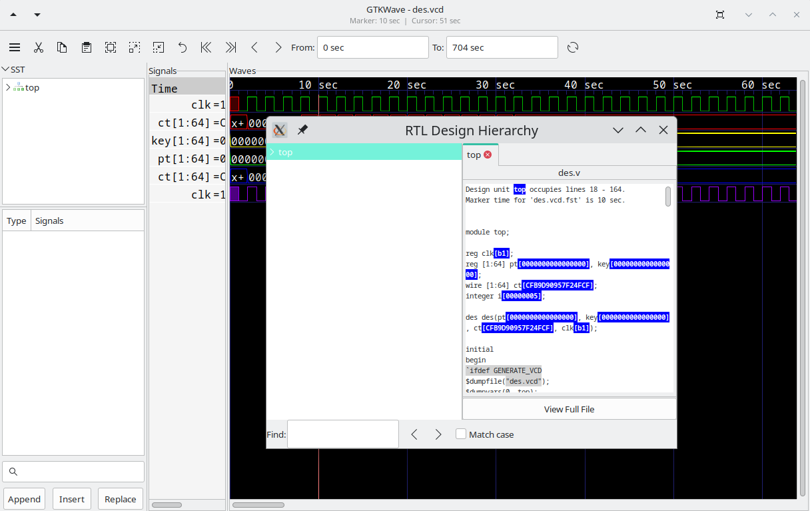

# Launching GTKWave

We already have a VZT file available, but to illustrate the automatic
conversion of VCD files, let's use the `-o` option. The `-t` option is used
to specify the stems file. The .sav file is a "save file" that contains
GTKWave scope state.

```text
/tmp/gtkwave-3.0.0/examples> gtkwave -o -t des.stems des.vcd
des.sav
GTKWave Analyzer v3.3.18 (w)1999-2010 BSI
FSTLOAD | Processing 1432 facs.
FSTLOAD | Built 1287 signals and 145 aliases.
FSTLOAD | Building facility hierarchy tree.
FSTLOAD | Sorting facility hierarchy tree.
```

:::{figure-md}



The main window with viewer state loaded from a save file
:::

In some cases, for example if the dumpfile format is
LXT2, you will see two sets of loader messages. This is normal as
RTLBrowse is launched as an external process in order to keep its
operations from bogging down the viewer. After these messages scroll by,
the GTKWave main window and an RTLBrowse hierarchy window will appear.
We are now ready to start experimenting with various features of the
wave viewer and RTLBrowse.

The RTLBrowse window will come up as seen in on page, however none of
the tree nodes will be opened yet.
