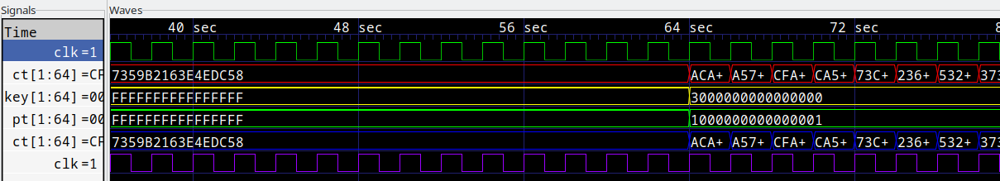
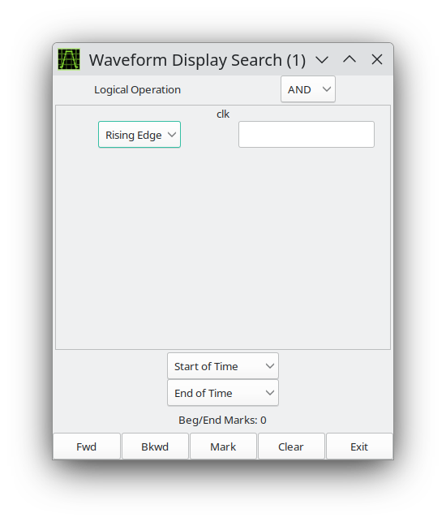
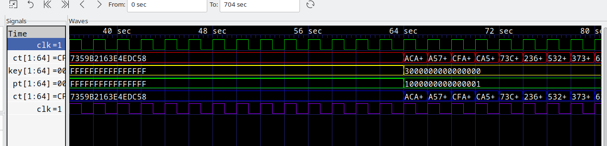

# Pattern Search

Not only nets may be searched on and marked in the main window. GTKWave
can search values too.
In order to do this, select one or more nets in the signal frame and
then click on the Search submenu option Pattern Search. A Pattern Search
Requester will then appear that will allow various types of search
operations for the signals that have been selected.

The following is an example of a Pattern Search Requester being used to
mark the **rising edges for the clock signal** in a simulation model.

1. First, select `clk` in Signals frame.

:::{figure-md}

Click clk in Signals frame
:::

2. Then, choose the Pattern Search option from the Search submenu.

3. In the pop-up window, set `Rising Edge` for clk and then click `Mark`.

:::{figure-md}

The Pattern Search Requester
:::

4. The rising edges of the clock signal will now be marked on the
wave window, as shown below.

:::{figure-md}

Wave frame with rising edge of clk marked
:::

To remove pattern marks, either select another pattern or select the
View submenu option `Remove Pattern Marks`. Note that pattern marks are saved
to the save file and that the actual pattern search criteria is saved,
not the absolute times of the individual marks themselves.

Search criteria for individual nets can be edge or value based. For
"String" searches (the entry box to the right of the search type box
which in the case above is marked "Rising Edge"), note that it is no
longer required that you must press Enter for the string in order to
commit the value to the search.
