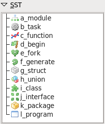
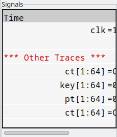
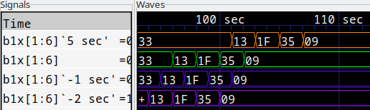
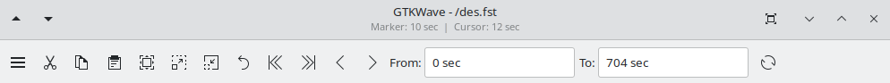

# GTKWave

```{toctree}
:hidden:
menu
```

## Main Window

The GTKWave visualization tool main window consists of a menu bar
section, an embedded Signal Search Tree (SST) expander, several buttons,
a time status section, and signal and wave value sections.

The main window size and position can be saved between sessions as well
as the current viewer state. (i.e., which signals are visible, any
attributes set for those signals such as alignment and inversion, where
the markers are set, and what pattern marking is active.)

:::{figure-md} the-gtkwave-main-window


The GTKWave main window
:::

To the middle left in a frame marked "Signals" is the signal section.
Signal names can be left or right aligned, and the number of levels of
hierarchy displayed can be set by the user. See `Set Max Hier` in
[Menu-Edit](./menu.md#edit) for more.

To the right of the signal section is the wave section in a frame marked
"Waves". The top line is used as a timescale, and all other lines are
used to render trace value data with respect to the timescale.
Analog traces of varying heights can be seen as well. Analog traces can
dynamically be made as tall or short as desired in order to make the
viewing of them easier. However, the size is limited to integer
multiples of the height of one digital trace.

To the left of the signal section is the embedded SST section.

## Signal Search Tree

Users can select the desired block from the SST tree hierarchy.
Then Drag and Drop the signals from the lower portion of the SST
into the "Signals" section to import traces.


In addition, signal direction and type information may be displayed in
the lower portion of the SST section as shown. To filter signals based on
the I/O port direction, prefix the search regular expression with
specific case-insensitive identifiers: `+I+` for inputs, `+IO+` for
input/output, `+O+` for outputs, `+L+` for linkage (in VHDL), and `+B+` for
buffers (in VHDL). Negative matching filters are also available,where `--`
only displays I/O ports, `-I-` excludes inputs, and `-O-` excludes outputs.
Conversely, `++` excludes all I/O ports.

:::{figure-md}


I/O and type information in SST frame with / without filter
:::

Depending on the capabilities of the file format loaded into GTKWave,
the SST frame/window may also depict the type of hierarchy being shown.
The figures below are representative of FST.

:::{figure-md}



Verilog hierarchy type icons in SST frame
:::

:::{figure-md}


VHDL (not GHDL) hierarchy type icons in SST frame
:::

## Signal Frame

:::{figure-md}



Signal frame with scrollbar
:::

The signal frame is nothing more than a list of signals,
optional comments, and optional blank lines. The following is a
sample view of the signal frame showing a highlighted trace `clk`
and a comment trace, `*** Other Traces ***`. In between the two is a
blank trace inserted by the user. Note that the highlighting of a trace
can be achieved by clicking the left mouse button on an entry in the
signal frame. (Use {kbd}`Control+Click` to deselect.)

You will notice that the scrollbar along the bottom of the frame
indicates that there is a hidden section to the right. This hidden area
contains the values of the signals, any time the primary marker is nailed
down. The scrollbar can be manually moved to show this area or the pane to the
right of the signal frame can be enlarged to allow full viewing of the frame.


:::{figure-md}


Signal frame with no hidden area from left to right
:::

As seen above, the signal names are right justified and are flush
against the equals signs. This is only a matter of personal preference,
and if desired, the signals can be left justified against
the left margin of the signal frame by pressing the key combination
of {kbd}`Shift+Home`. This is useful for detection hierarchy differences
for different net names. Press {kbd}`Shift+End` to right justify the signal names. (Right
justification is the default behavior). Regardless of the state of
signal name justification, the signal values are left justified against
the equal sign and cannot be moved.


:::{figure-md}


Signal frame with left justified signal names
:::

Note that the signal frame supports a form of self-contained Drag
and Drop such that the right mouse button can be used to harvest all the
highlighted traces in the window. By holding the right button and moving
the mouse up and down, a destination for the traces can be selected.
When the mouse button is released, the traces are dropped at the trace
following the one the mouse pointer is pointing to.

Multiple traces can be selected by marking the first trace to highlight,
move the cursor to the destination trace, and {kbd}`Shift+Click` with the left
mouse button. All the traces between the two will highlight or
unhighlight accordingly. To highlight all the traces in the signal
frame, {kbd}`Alt+H` can be pressed. To unhighlight them, also press the
{kbd}`Shift` key in conjunction with {kbd}`Alt-H`. (This can also be achieved by
clocking on Highlight All or Unhighlight All in the Edit menu.)

Highlighting or unhighlighting traces by entering regular expressions
will be covered in the menu section.

In addition, the scroll wheel will scroll the traces up and down when the
signal frame has input focus.

## Wave Frame

:::{figure-md}


A typical view of the wave frame
:::

The wave frame reformats simulation data into a visual format similar
to that seen for digital storage scopes. The wave frame contains two
scrollbars and a viewing area.

The scrollbar on the right controls not only the wave frame, but the
signal frame in lockstep as well. The scrollbar on the bottom is
used to scroll the simulation data with respect to the timescale that is
shown on the top line of the wave frame.

The simulation data itself is shown as a horizontal series of traces.
Values for multi-bit signals can be displayed in varying numeric bases
such as binary, octal, hexadecimal, decimal, and ASCII. Values for
single-bit traces are shown as "high" for zero and "low" for one, "z"
(middle), and "x" (filled-in box). VHDL values are represented in a
similar fashion but with different colors. The signal frame can
always be used to verify the value of a value. So don't be too
concerned right now if you are not sure of what the single-bit
representation of a signal looks like or are not sure if you can
remember.

Two functional markers are available: the primary marker (red, use left
mouse button to drop) which the signal window uses as its pointer for value
data, and the baseline marker (white, use middle mouse button to drop) which
is used to perform time measurements with respect to the primary marker.
Twenty-six lettered markers "A" through "Z" (dropped or collected
through menu options) are provided to the user as convenience markers
for indexing various points of interest in a simulation.

The primary marker can also be used to navigate with respect to time. It
can be dropped with the right mouse button and dragged to "open" up a
region for zooming in closer or out farther in time. It can also be used
to scroll by holding down the left mouse button and dragging the mouse
outside the signal frame. The simulation data outside the window will
then scroll into view with the scrolling being in the opposite
direction that the primary marker is "pulling" outside the frame.

Trace data in the signal frame can also be timeshifted as shown below.
To timeshift a trace, highlight the trace in the signal window the
move over to the wave frame and then hold down the left mouse
button to set the primary marker. Press the {kbd}`Control` key then move
the primary marker left or right. When the timeshift is as desired,
release the mouse button then release {kbd}`Control`. If you do not wish to go
through with the timeshift, release the {kbd}`Control` key before releasing the
left mouse button. The trace(s) will then spring back to their original
pre-shifted position.

:::{figure-md}



An example of both positively and negatively timeshifted traces
:::

To achieve a finer level of granularity for timeshifting, menu options
are available that allow the user to set specific values for a time shift.
In this way, the pixel resolution of zoom is not the limiting factor in
achieving an "exact" shift that suits a user's needs.

## Navigation and Status Panel

The navigation occupies the top part of the main window.

:::{figure-md}



The Navigation and Status Panel
:::

The Navigation Panel contains useful tools like `Zoom In/Out` and 
`Find Edge`.

`Menu`
: _Menu_ will open the Menu of GTKWave.

`Cut Traces`
: _Cut Traces_ removes highlighted signals from the display and places 
them in an offscreen cut/copy buffer for later Paste operations.
It also implicitly destroys the previous contents of the cut/copy buffer.

`Copy Traces`
: _Copy Traces_ copies highlighted signals from the display
and places them in an offscreen cut/copy buffer for later Paste operations.
It also implicitly destroys the previous contents of the cut/copy buffer.

`Paste Traces`
: _Paste Traces_ pastes signals from an offscreen cut/copy buffer and
places them in a group after the last highlighted signal, or at the
end of the display if no signal is highlighted.

`Zoom Fit`
: _Zoom Fit_ zoom out to display the full range of simulation time.
If the baseline marker is set, zooms between the baseline marker
and the primary marker.

`Zoom In`
: _Zoom In_ is used to increase the zoom factor around the marker.
Same as {kbd}`Control+ScrollwheelUp`.

`Zoom Out`
: _Zoom Out_ is used to decrease the zoom factor around the marker.
Same as {kbd}`Control+ScrollwheelDown`.

`Zoom Undo`
: _Zoom Undo_ is used to revert to the previous zoom value used.
Undo only works one level deep.

`Zoom to Start`
: _Zoom to Start_ is used to jump to the trace's beginning.

`Zoom to End`
: _Zoom to End_ is used to jump to the trace's end.

`Find Previous Edge`
: _Find Previous Edge_ moves the marker to the nearest transition
on the left side of the primary marker of the last highlighted trace.
Same as {kbd}`Alt+ScrollwheelUp`.
If the primary marker is not located, it starts from max time.

`Find Next Edge`
: _Find Next Edge_ moves the marker to the nearest transition
on the right side of the primary marker of the last highlighted trace.
Same as {kbd}`Alt+ScrollwheelDown`.
If the primary marker is not located, it starts from min time.

`From / To boxes`
: _The "From" and "To" boxes_ indicate the start and end times for what part
of the simulation run shall be visible and can be navigated inside the
wave frame. Values can directly be entered into these boxes, and
units (e.g., ns, ps, fs) can also be affixed to values. Named marker
is also supported, use `MX` for named marker `X`.

`Reload`
: _Reload_ will reload the currently displayed waveform.
Only available with some dumpfile types.

The Marker Time label indicates where the primary marker is located. If
it is not present, a double-dash ("\--") is displayed. The Current Time
label indicates where the mouse is pointing. Its function is to
determine the time under the cursor without having to activate or move
the primary marker. Note that when the primary marker is being
click-dragged, the Marker Time label will indicate the delta time off
the initial marker click.

When the baseline marker is set. The Current Time label is replaced
with the Base Time label that indicates the value of the baseline
marker. Then the Marker time label indicates the delta time between
the baseline marker and the primary marker.

## Menu

There are seven submenus in the menu bar: File, Edit, Search, Time,
Markers, View, and Help. The functions of the individual items in each
of those submenus will be covered in [GTKWave Menu Functions](menu.md#gtkwave-menu-functions).
