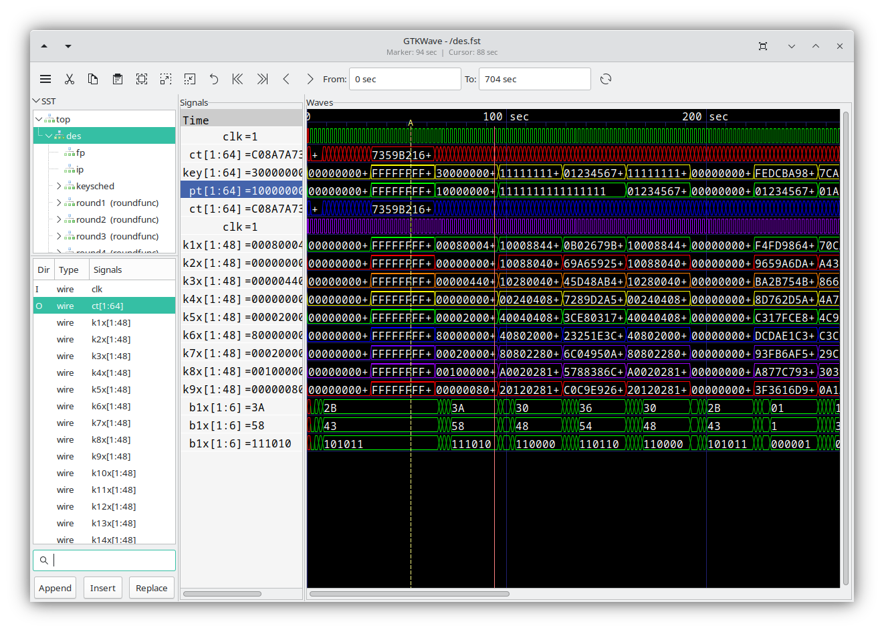

# Overview

The GTKWave visualization tool main consists of a menu bar
section, an embedded Signal Search Tree (SST) expander, several buttons,
a time status section, and signal and wave value sections.

The main window size and position can be saved between sessions as well
as the current viewer state. (i.e., which signals are visible, any
attributes set for those signals such as alignment and inversion, where
the markers are set, and what pattern marking is active.)

:::{figure-md} the-gtkwave-main-window

The GTKWave main window
:::

To the middle left in a frame marked "Signals" is the signals frame.
Signal names can be left or right aligned, and the number of levels of
hierarchy displayed can be set by the user. See `Set Max Hier` in
[Menu-Edit](./menu.md#edit) for more.

To the right of the signal section is the wave section in a frame marked
"Waves". The top line is used as a timescale, and all other lines are
used to render trace value data with respect to the timescale.
Analog traces of varying heights can be seen as well. Analog traces can
dynamically be made as tall or short as desired in order to make the
viewing of them easier. However, the size is limited to integer
multiples of the height of one digital trace.

To the left of the signal section is the embedded SST section.