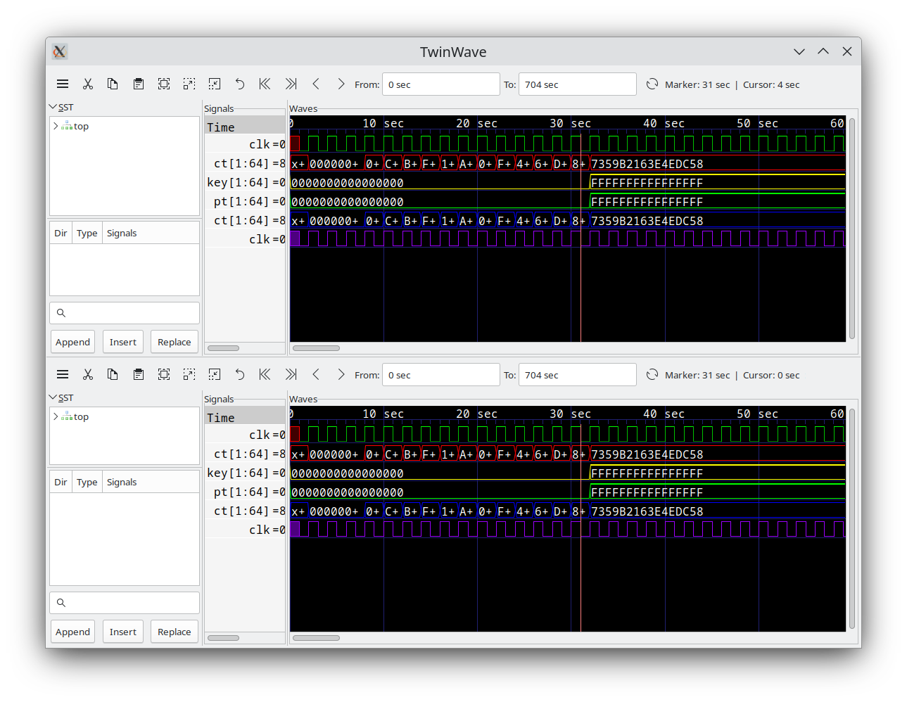
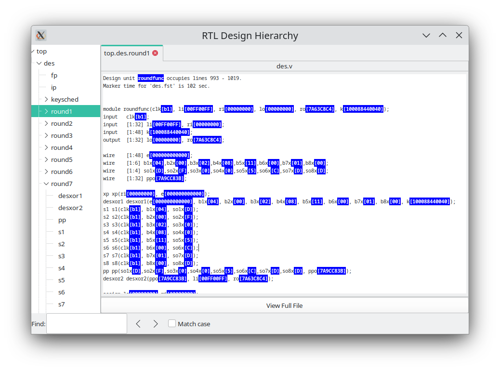

# GTKWave User Interface

## GTKWave

### Main Window

The GTKWave visualization tool main window is comprised of a menu bar
section, a status window, several groups of buttons, a time status
section, and signal and wave value sections. New with GTKWave 3.0 is the
inclusion of an embedded Signal Search Tree (SST) expander to the left
of the signal section. The viewer typically appears as below when the
embedded SST is disabled.

:::{figure-md}


The GTKWave main window
:::

To the extreme left in a frame marked "Signals" is the signal section.
Signal names can be left or right aligned (left aligned being useful for
detection of hierarchy differences) and the number of levels of
hierarchy (as counting from the rightmost side of a signal name)
displayed can be set by the user.

To the right of the signal section is the wave section in a frame marked
"Waves". The top line is used as a timescale and all other lines are
used to render trace value data with respect the timescale. The vertical
blue lines in the trace value data section are not normally present. In
this case they are the result of keying on the rising edge of the
digital signal "pll_divclk". Analog traces of varying heights can be
seen as well. Analog traces can dynamically be made as tall or short as
desired in order to make the viewing of them easier, however the size is
limited to integer multiples of the height of one digital trace.

With GTK versions greater than or equal to 2.4, an embedded SST is
available. Drag and Drop of signals from the "Signals" pane inside the
SST into the "Signals" pane outside of the SST is a convenient way to
import signals into the viewer.

:::{figure-md}


The main window with an embedded SST
:::

The main window size and position can be saved between sessions as well
as the current viewer state. (i.e., which signals are visible, any
attributes set for those signals such as alignment and inversion, where
the markers are set, and what pattern marking is active.)

Depending on the capabilities of the file format loaded into GTKWave,
the SST frame/window may also depict the type of hierarchy being shown.
The figures below are representative of FST.

:::{figure-md}


Verilog hierarchy type icons in SST frame
:::

:::{figure-md}


VHDL (not GHDL) hierarchy type icons in SST frame
:::

In addition, signal direction and type information may be displayed in
the lower portion of the SST frame/window as shown. To filter based on
I/O port direction, prefix the search regular expression with
case-insensitive +I+ for input, +IO+ for input/output, +O+ for output,
+L+ for linkage (VHDL), and +B+ for buffer (VHDL). Negative matching
occurs such that \-- only displays I/O ports, -I- displays all but
inputs, and -O- displays all but outputs. In a similar fashion, ++
displays all except I/O ports.

:::{figure-md}


Verilog I/O and type information in SST frame
:::

### Toolbutton Interface

The use_toolbutton_interface rc variable controls how the user interface
appears. Recent versions of the viewer have this variable set to "on"
which modifies the viewer to use GTK themes and a more compact button
layout as shown below.

:::{figure-md}


The main window using the toolbutton interface
:::

For those who wish to use the old interface, the rc variable must be set
to "off." In future versions of the viewer, it will be possible for the
layout of the Toolbutton bar to be specified by a user\'s configuration.

### Signal Subwindow

:::{figure-md}


Signal subwindow with scrollbar and an "open" collapsible trace
:::

The signal subwindow is nothing more than a list of
signals, optional comments, and optional blank lines. The following is a
sample view of the signal subwindow showing a highlighted trace ("clk")
and a comment trace, "Non-clock Traces \*\*\*". In between the two is a
blank trace inserted by the user. Note that the highlighting of a trace
can be accomplished by clicking the left mouse button on an entry in the
signal subwindow. (Use {kbd}`Control+Click` to deselect.)

You will notice that the scrollbar along the bottom of the subwindow in
indicates that there is a hidden section to the right. This hidden area
contains the values of the signals shown. The scrollbar can be manually
moved to show this area or the pane to the right of the signal subwindow
can be enlarged in order to allow full viewing of the subwindow.

:::{figure-md}


Signal subwindow with no hidden area from left to right
:::

Expanding the size of the subwindow by increasing the
width of the pane is illustrated in . No area is hidden as reflected by
the scrollbar which is completely filled in from left to right along its
length. In addition, the signal values which are present can be read.
Any time the primary marker is nailed down, there will be an equals
("=") sign indicating that signal values are present.

:::{figure-md}


Signal subwindow with left justified signal names
:::

As seen in both and , the signal names are right justified and are flush
against the equals signs. This is only a matter of personal preference,
and if desired, as shown in , the signals can be left justified against
the left margin of the signal subwindow by pressing the key combination
of {kbd}`Shift+Home`. This is useful when looking at signals if one is
attempting to determine where hierarchies for different net names
differ. Press {kbd}`Shift+End` to right justify the signal names. (Right
justification is the default behavior). Regardless of the state of
signal name justification, the signal values are left justified against
the equals sign and cannot be moved.

Note that the signal subwindow supports a form of self-contained Drag
and Drop such that the right mouse button can be used to harvest all the
highlighted traces in the window. By holding the right button and moving
the mouse up and down, a destination for the traces can be selected.
When the mouse button is released, the traces are dropped at the trace
following the one the mouse pointer is pointing to.

Multiple traces can be selected by marking the first trace to highlight,
move the cursor to the destination trace, and {kbd}`Shift+Click` with the left
mouse button. All the traces between the two will highlight or
unhighlight accordingly. To highlight all the traces in the signal
subwindow, {kbd}`Alt+H` can be pressed. To unhighlight them, also press the
{kbd}`Shift` key in conjunction with {kbd}`Alt-H`. (This can also be achieved by
clocking on Highlight All or Unhighlight All in the Edit menu.)

Highlighting or unhighlighting traces by entering regular expressions
will be covered in the menu section.

Note: the rc variable use_standard_clicking no longer has any effect.
Regular GTK semantics for this subwindow are always enabled: shift and
control function as most users expect. In addition, the scroll wheel
will scroll the traces up and down provided the signal subwindow has
input focus.

### Wave Subwindow

:::{figure-md}


A typical view of the wave subwindow
:::

The wave subwindow reformats simulation data into a
visual format similar to that seen for digital storage scopes. As seen
in, the wave subwindow contains two scrollbars and a viewing area.

The scrollbar on the right scrolls not only the wave subwindow, but the
signal subwindow in lockstep as well. The scrollbar on the bottom is
used to scroll the simulation data with respect to the timescale that is
shown on the top line of the wave subwindow.

The simulation data itself is shown as a horizontal series of traces.
Values for multi-bit signals can be displayed in varying numeric bases
such as binary, octal, hexadecimal, decimal, and ASCII. Values for
single-bit traces are shown as "high" for zero and "low" for one, "z"
(middle), and "x" (filled-in box). VHDL values are represented in a
similar fashion but with different colors. The signal subwindow can
always be used to verify the value of a value, so don't be too
concerned right now if you are not sure of what the single-bit
representation of a signal looks like or are not sure if you can
remember.

Two functional markers are available: the primary marker (red, left
mouse button) which the signal window uses as its pointer for value
data, and the baseline marker (white, middle mouse button) which is used
to perform time measurements with respect to the primary marker.
Twenty-six lettered markers "A" through "Z" (dropped or collected
through menu options) are provided to the user as convenience markers
for indexing various points of interest in a simulation.

The primary marker can also be used to navigate with respect to time. It
can be dropped with the right mouse button and dragged to "open" up a
region for zooming in closer or out farther in time. It can also be used
to scroll by holding down the left mouse button and dragging the mouse
outside the signal subwindow. The simulation data outside of the window
will then scroll into view with the scrolling being in the opposite
direction that the primary marker is "pulling" outside of the subwindow.

Trace data in the signal subwindow can also be timeshifted as shown in .
In order to timeshift a trace, highlight the trace in the signal window
the move over to the wave subwindow and then hold down the left mouse
button in order to set the primary marker. Press the {kbd}`Control` key then move
the primary marker left or right. When the timeshift is as desired,
release the mouse button then release {kbd}`Control`. If you do not wish to go
through with the timeshift, release the {kbd}`Control` key before releasing the
left mouse button. The trace(s) will then spring back to their original
pre-shifted position.

:::{figure-md}


An example of both positively and negatively timeshifted traces
:::

To achieve a finer level of granularity for
timeshifting, menu options are available that allow the user to set
specific values for a time shift. In this way, the pixel resolution of
zoom is not the limiting factor in achieving an "exact" shift that suits
a user's needs.

### Navigation and Status Panel

The navigation and status panel occupies the top part of the main window
just below the menu bar.

:::{figure-md}


The Navigation and Status Panel
:::

The leftmost part contains a status window used for
displaying various relevant messages to the user such as the dumpfile
type, the number of facilities (nets) in a dumpfile, and any other
information such as an operation that fails or completes successfully.

The Zoom subframe contains six buttons. Three are magnifying glass
icons. The one marked with a minus ("-") zooms out which displays a
larger amount of simulation time. The one marked with a plus ("+") zooms
in closer, displaying less simulation time. The one with a square in it
is "Zoom Full" which is used either to zoom out to display the full
range of simulation time or zooms between the primary and baseline
marker when the baseline marker is set. The remaining non-magnifying
glass buttons are a back arrow which is a zoom undo. The left arrow
"zooms" to the start time of simulation and the right arrow zooms to the
end time. The left and right arrows do not affect the zoom level in or
out like the plus and minus buttons do; they simply are a shortcut to
keep from having to move the scrollbar at the bottom of the wave
subwindow.

The Page subframe contains left and right arrows. It scrolls the wave
window left or right the granularity of one page. It is similar to
clicking to the left or right of the "visible" gadget in a scrollbar,
however, given the limited resolution of the GTK scrollbar (floating
point), for simulations that have large time values, it might be
necessary to use the page buttons rather than the scrollbar.

The Shift subframe contains similar arrows that scroll the display one
pixel or timestep (depending on what the zoom level is).

The "From" and "To" boxes indicate the start and end times for what part
of the simulation run shall be visible and can be navigated inside the
wave subwindow. Values can directly be entered into these boxes and
units (e.g., ns, ps, fs) can also be affixed to values.

The Fetch and Discard subframes modify the "From" and "To" box times.
Clicking the left Fetch arrow decreases the "From" value. Clicking the
right Fetch arrow increases the "To" value. Clicking the left Discard
value increases the "From" value and clicking the right Discard button
decreases the "To" value.

The Marker Time label indicates where the primary marker is located. If
it is not present, a double-dash ("\--") is displayed. The Current Time
label indicates where the mouse is pointing. Its function is to
determine the time under the cursor without having to activate or move
the primary marker. Note that when the primary marker is being
click-dragged, the Marker Time label will indicate the delta time off
the initial marker click.

When the baseline marker is set, the Marker Time and Current Time labels
change. The Marker time label indicates the delta time between the
baseline marker and the primary marker. The Current Time label is
replaced with a Base Time label that indicates the value of the baseline
marker.

With some dumpfile types, a reload button can be found at the extreme
right side of the Navigation and Status Panel. It may be seen in on page
.

Menu Bar

There are seven submenus in the menu bar: File, Edit, Search, Time,
Markers, View, and Help. The functions of the individual items in each
of those submenus will be covered in GTKWave Menu Functions on page
[35](#anchor-24).

## TwinWave

TwinWave is a front end to GTKWave that allows two sessions to be open
at one time in a single window. The horizontal scrolling, zoom factor,
primary marker, and secondary marker are synchronized between the two
sessions.

:::{figure-md}



TwinWave managing two GTKWave sessions in a single window
:::

Starting a TwinWave session is easy: simply invoke
twinwave with the arguments for each gtkwave session listed fully
separating them with a plus sign.

```bash
twinwave a.vcd a.sav + b.vcd b.sav
```

## RTLBrowse

rtlbrowse is usually called as a helper application by gtkwave. In order
to use RTLBrowse, Verilog source code must first be compiled with
xml2stems in order to generate a stems file. A stems file contains
hierarchy and component instantiation information used to navigate
quickly through the source code. If GTKWave is started with the
**\--stems** option, the stems file is parsed and rtlbrowse is launched.

The main window for RTLBrowse depicts the design as a tree-like
structure. (See on page .) Nodes in the tree may be clicked open or
closed in order to navigate through the design hierarchy. Missing
modules (unparsed, but instantiated as components) will be marked as
"\[MISSING\]".

When an item is selected, another window is opened showing only the
source code the selected module. If the primary marker is set, then the
source code will be annotated with values as shown in on page . If the
primary marker moves or is deleted, then the values annotated into the
source code will be updated dynamically. The values shown are the full,
wide value of the signal. RTLBrowse currently does not perform bit
extractions on multi-bit vectors. If it is desired to see the full
source code file for a module, click on the "View Full File" button at
the bottom of the window.

Note that it is possible to descend deeper into the design hierarchy by
selecting the component name in the annotated or unannotated source
code.

:::{figure-md}


The RTLBrowse RTL Design Hierarchy window
:::

:::{figure-md}


Source code annotated by RTLBrowse
:::

## Ergonomic Extras

### Scroll Wheels

Users with a scroll wheel mouse have some extra one-handed operations
options available which correspond to some functions found in the
Navigation and Status Panel description on page [27](#anchor-16).

| Function   | Shortcut                         |
|------------|----------------------------------|
| Shift Right| {kbd}`Control+Scroll_Wheel_Down` |
| Shift Left | {kbd}`Control+Scroll_Wheel_Up`   |
| Page Right | {kbd}`Scroll_Wheel_Down`         |
| Page Left  | {kbd}`Scroll_Wheel_Up`           |
| Zoom In    | {kbd}`Alt+Scroll_Wheel_Down`     |
| Zoom Out   | {kbd}`Alt+Scroll_Wheel_Up`       |

Turning the scroll wheel "presses" the shift, page, and zoom options
repeatedly far faster than is possible with the navigation buttons. Zoom
functions are especially smooth this way.

### The Primary Marker

The primary marker has also had function overloaded onto it for user
convenience. Besides being used as a marker, it can also be used to
navigate with respect to time. It can be dropped with the right mouse
button and dragged to "open" up a region for zooming in closer or out
farther in time. It can also be used to scroll by holding down the left
mouse button and dragging the mouse outside the signal subwindow. The
simulation data outside of the window will then scroll into view with
the scrolling being in the opposite direction that the primary marker is
"pulling" outside of the subwindow.

### Interactive VCD

VCD files may be viewed as they are generated provided that they are
written to a fifo (pipe) and are trampolined through shmidcat first
(assume the simulator will normally generate *outfile.vcd*):

```bash
mkfifo outfile.vcd
cver myverilog.v &
shmidcat outfile.vcd | gtkwave -v -I myverilog.sav
```

You can then navigate the file as simulation is running and watch it
update.
